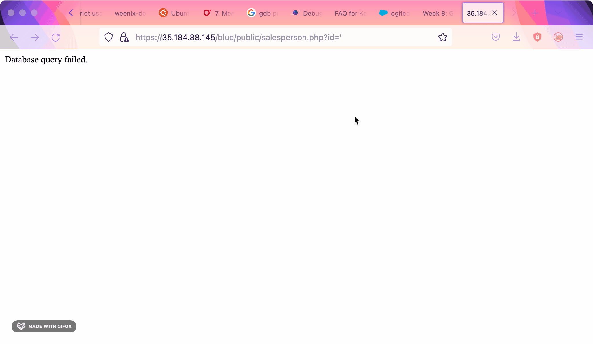
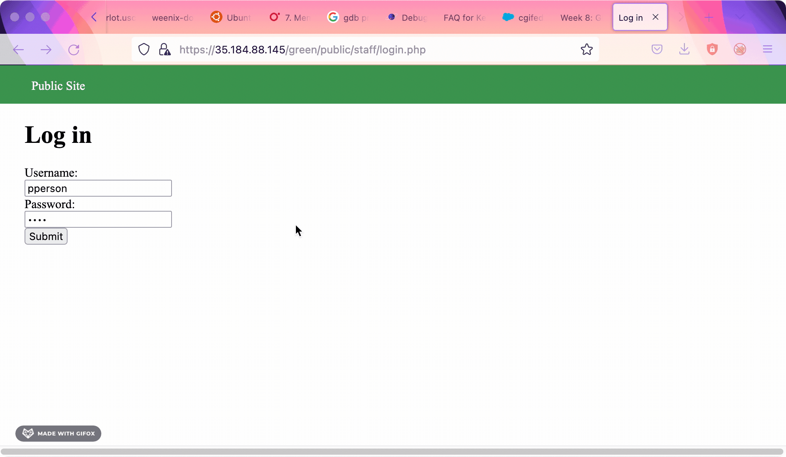
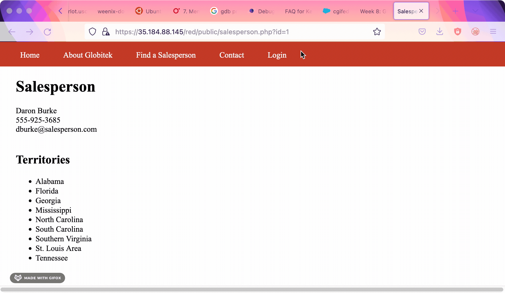

# Project 9 - Pentesting Live Targets

Time spent: 4 hours spent in total

> Objective: Identify vulnerabilities in three different versions of the Globitek website: blue, green, and red.

The six possible exploits are:

* Username Enumeration
* Insecure Direct Object Reference (IDOR)
* SQL Injection (SQLi)
* Cross-Site Scripting (XSS)
* Cross-Site Request Forgery (CSRF)
* Session Hijacking/Fixation

Each color is vulnerable to only 2 of the 6 possible exploits. First discover which color has the specific vulnerability, then write a short description of how to exploit it, and finally demonstrate it using screenshots compiled into a GIF.

## Blue

Vulnerability #1: SQL Injection (SQLi)

Description:
Sleep is possible by manipulating the url and injecting SQL

## Green

Vulnerability #1: Username Enumeration

Description:
We can identify valid usernames based on the style of the error which helps us generate a list of valid usernames

## Red

Vulnerability #1: Insecure Direct Object Reference (IDOR)

Description:
Information not intended for the general audience is seen by URL manipulation

## Notes

Describe any challenges encountered while doing the work
